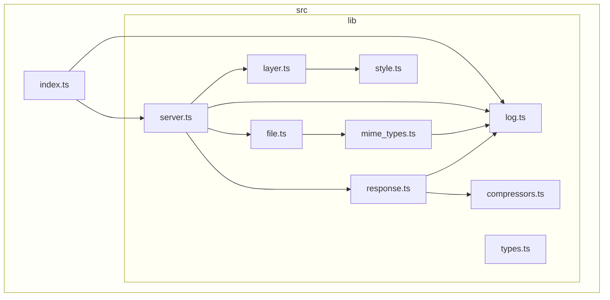

[](https://codecov.io/gh/versatiles-org/node-versatiles-server)
[](https://github.com/versatiles-org/node-versatiles-server/actions/workflows/ci.yml)

# VersaTiles - Server

A Node.js server for [VersaTiles containers](https://github.com/versatiles-org/versatiles-spec).

## Install globally

```bash
npm i -g @versatiles/server
```

## Run

```bash
versatiles-server --help
```

This will show you how to use the server with all options and arguments.

For example:

```bash
versatiles-server planet.versatiles
```

## Options

<!--- This chapter is generated automatically --->

```console
$ versatiles-server
Usage: versatiles-server [options] <source>

Simple VersaTiles server

Arguments:
  source                   VersaTiles container, can be a URL or filename of a
                           "*.versatiles" file

Options:
  -b, --base-url <url>     Base URL for the server (default:
                           "http://localhost:<port>/")
  -c, --compress           Reduces traffic by recompressing data, but responses
                           take longer. Perfect if behind CDN.
  -h, --host <hostnameip>  Hostname or IP to bind the server to (default:
                           "0.0.0.0")
  -o, --open               Open map in web browser
  -p, --port <port>        Port to bind the server to (default: 8080)
  -q, --quiet              be quiet
  -s, --static <folder>    Path to a folder with static files
  -t, --tms                Use TMS tile order (flip y axis)
  -v, --verbose            be verbose
  --help                   display help for command
```

## Dependency Graph

<!--- This chapter is generated automatically --->



## License

[Unlicense](./LICENSE.md)
